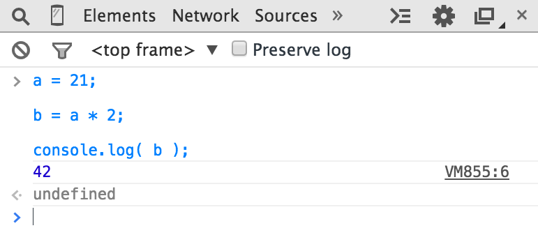

# You Don't Know JS: Up & Going
# Chapter 1: Into Programming

You Do not Know JS (YDKJS) 시리즈에 오신 것을 환영합니다.

Up & Going은 프로그래밍의 몇 가지 기본 개념을 소개합니다. 물론 우리는 JavaScript (종종 JS로 약칭 됨)쪽으로 기울어졌으며,이 시리즈의 나머지 타이틀에 접근하고 이해하는 방법에 대해서도 설명합니다. 특히 프로그래밍 및 / 또는 자바 스크립트에 익숙해 진 분들에게이 책은 여러분이 일어나고 싶어하는 것을 간략히 탐색합니다.

이 책은 매우 높은 수준에서 프로그래밍의 기본 원칙을 설명하기 시작합니다. 사전 프로그래밍 경험이 거의 없거나 전혀없이 YDKJS를 시작하고 자바 스크립트 렌즈를 통해 프로그래밍을 이해하는 데 도움이되는 이러한 책을 찾고있는 경우에 주로 사용됩니다.

제 1 장은 프로그래밍에 대해 더 배우고 연습하기를 원하는 것들에 대한 간략한 개요로 접근해야합니다. 또한이 주제를 더 깊이 파헤치는 데 도움이되는 다른 많은 프로그래밍 도입 자원이 있으며,이 장과 함께 이들로부터 배울 것을 권장합니다.

일반적인 프로그래밍 기본 사항에 익숙해지면 2 장은 JavaScript 프로그래밍의 익숙 함을 알려줍니다. 2 장에서는 JavaScript에 대해 소개하지만, 포괄적 인 가이드는 아닙니다. 나머지 YDKJS 서적은 무엇을위한 것입니까!

이미 JavaScript에 익숙하다면, 3 장에서 YDKJS에서 기대할 수있는 것을 간략히 살펴본 다음, 바로 뛰어 들어보십시오!

## Code

처음부터 시작합시다.

흔히 소스 코드 또는 코드라고하는 프로그램은 수행 할 작업을 컴퓨터에 알려주는 특수 지침 세트입니다. 일반적으로 코드는 텍스트 파일에 저장됩니다. 자바 스크립트를 사용하면 브라우저의 개발자 콘솔에 직접 코드를 입력 할 수도 있습니다. 곧 다룰 내용을 살펴 보겠습니다.

유효한 형식 및 명령어의 조합에 대한 규칙을 컴퓨터 언어라고하며 구문 분석이라고도하며 영어와 거의 같은 방식으로 철자를 쓰는 방법과 단어와 구두점을 사용하여 유효한 문장을 만드는 방법을 알려줍니다.

### Statements

컴퓨터 언어에서 특정 작업을 수행하는 단어, 숫자 및 운영자 그룹이 성명서입니다. JavaScript에서는 구문이 다음과 같이 보일 수 있습니다.

```js
a = b * 2;
```

문자 a와 b는 변수 ( "변수"참조)라고하며, 간단한 상자처럼 물건을 저장할 수 있습니다. 프로그램에서 변수는 프로그램에서 사용할 값 (예 : 42)을 포함합니다. 가치 그 자체의 상징적 자리 표시 자라고 생각하십시오.

대조적으로, 2는 변수 자체에 저장되지 않고 혼자 있기 때문에 리터럴 값이라고하는 값 자체 일뿐입니다.

= 및 * 문자는 연산자 ( "연산자"참조)입니다. 할당 및 수학적 곱셈과 같은 값 및 변수를 사용하여 작업을 수행합니다.

JavaScript의 대부분의 문장은 끝에 세미콜론 (;)으로 끝납니다.

a = b * 2; 대략 컴퓨터에 변수 b에 저장된 현재 값을 얻고 그 값에 2를 곱한 다음 결과를 다시 다른 변수에 저장합니다.

프로그램은 단지 프로그램 목적을 수행하는 데 필요한 모든 단계를 설명하는 많은 명령문의 모음입니다.

### Expressions

명령문은 하나 이상의 표현식으로 구성됩니다. 표현식은 변수 또는 값에 대한 참조이거나 연산자와 결합 된 변수 및 값의 집합입니다.

예 :

```js
a = b * 2;
```

이 명령문에는 4 개의 표현식이 있습니다.

* 2는 리터럴 값 표현식입니다.
* b는 현재 값을 검색하는 변수 표현식입니다.
* b * 2는 곱셈을하는 것을 의미하는 산술 표현식입니다.
* a = b * 2는 b * 2 표현식의 결과를 변수 a에 대입하는 대입 표현식입니다 (할당에 대해서는 나중에 자세히 설명 함)

단독으로 사용되는 일반 표현식은 다음과 같은 표현식 문이라고도합니다.

```js
b * 2;
```

이 표현 문은 일반적으로 프로그램 실행에 아무런 영향을 미치지 않기 때문에 매우 일반적이거나 유용하지 않습니다. b의 값을 검색하여 2를 곱한 다음 아무 것도하지 않습니다. 그 결과.

보다 일반적인 표현식 문은 전체 표현식이 함수 호출 표현식이므로 호출 표현 문 ( "함수"참조)입니다.

```js
alert( a );
```

### Executing a Program

이러한 프로그래밍 문학 컬렉션은 컴퓨터에 무엇을해야한다고 말합니까? 프로그램을 실행해야하며 프로그램 실행이라고도합니다.

a = b * 2와 같은 문은 개발자가 읽고 쓰는 데 도움이되지만 실제로 컴퓨터가 직접 이해할 수있는 형식은 아닙니다. 따라서 컴퓨터의 특별한 유틸리티 (인터프리터 또는 컴파일러)는 작성한 코드를 컴퓨터가 이해할 수있는 명령으로 변환하는 데 사용됩니다.

일부 컴퓨터 언어의 경우,이 명령의 변환은 프로그램이 실행될 때마다 대개 한 줄씩 위에서부터 차례대로 수행됩니다. 일반적으로 코드 해석이라고합니다.

다른 언어의 경우 번역은 코드 컴파일이라고 미리 수행되기 때문에 프로그램이 나중에 실행될 때 실행중인 것은 실제로 이미 컴파일 된 컴퓨터 명령어입니다.

일반적으로 자바 스크립트 소스 코드는 실행될 때마다 처리되므로 자바 스크립트가 해석된다고 주장합니다. 그러나 그것은 완전히 정확하지 않습니다. JavaScript 엔진은 실제로 프로그램을 즉시 컴파일 한 다음 컴파일 된 코드를 즉시 실행합니다.

참고 : JavaScript 컴파일에 대한 자세한 내용은이 시리즈의 Scope & Closures 제목의 처음 두 장을 참조하십시오.

## Try It Yourself

이 장에서는 모든 프로그래밍 개념을 간단한 코드 스 니펫으로 소개 할 것이며, 모두 JavaScript로 작성됩니다 (분명히!).

충분히 강조 할 수는 없지만이 장을 읽는 동안 시간을 ​​들여 여러 번 반복해야 할 수도 있습니다. 코드를 직접 입력하여 이러한 각 개념을 연습해야합니다. 가장 쉬운 방법은 가장 가까운 브라우저 (Firefox, Chrome, IE 등)에서 개발자 도구 콘솔을 여는 것입니다.

팁 : 일반적으로 키보드 단축키 또는 메뉴 항목을 사용하여 개발자 콘솔을 시작할 수 있습니다. 자주 사용하는 브라우저에서 콘솔을 시작하고 사용하는 방법에 대한 자세한 내용은 "Developer Tools Console 마스터 링"(http://blog.teamtreehouse.com/mastering-developer-tools-console)을 참조하십시오. 한 번에 여러 줄을 콘솔에 입력하려면 <shift> + <enter>를 사용하여 다음 줄로 이동하십시오. <enter>를 누르면 콘솔이 방금 입력 한 모든 것을 실행합니다.

콘솔에서 코드를 실행하는 프로세스에 익숙해 지자. 먼저, 브라우저에서 빈 탭을 열 것을 제안합니다. 주소 표시 줄에 about : blank를 입력하면됩니다. 방금 언급 한 바와 같이 개발자 콘솔이 열려 있는지 확인하십시오.

이제이 코드를 입력하고 실행 방법을 확인하십시오.

```js
a = 21;

b = a * 2;

console.log( b );
```

Chrome의 콘솔에 위 코드를 입력하면 다음과 같은 결과가 나타납니다.



어서, 해봐. 프로그래밍을 배우는 가장 좋은 방법은 코딩을 시작하는 것입니다!

### Output

이전 코드에서 console.log (..)를 사용했습니다. 간단히 말해서, 그 코드 라인이 무엇을 의미하는지 살펴 보겠습니다.

짐작할 수 있겠지만 개발자 콘솔에서 텍스트 (사용자에게 출력)를 인쇄하는 방법입니다. 그 성명서에는 우리가 설명해야 할 두 가지 특징이 있습니다.

먼저 log (b) 부분을 함수 호출이라고합니다 ( "함수"참조). 우리는 b 변수를 그 함수에 건네주고, b의 값을 받아서 콘솔에 출력 할 것을 요구합니다.

둘째, 콘솔. part는 log (..) 함수가있는 객체 참조입니다. 우리는 객체와 그 속성을 2 장에서 자세히 다루고 있습니다.

출력을 생성하는 또 다른 방법은 경고 (..) 문을 실행하는 것입니다. 예 :

```js
alert( b );
```

이를 실행하면 출력을 콘솔에 인쇄하는 대신 b 변수의 내용이있는 "OK"상자가 나타납니다. 그러나 console.log (..)를 사용하면 브라우저 인터페이스를 방해하지 않고 즉시 많은 값을 출력 할 수 있기 때문에 일반적으로 alert (..)을 사용하는 것보다 콘솔에서 프로그램 코딩 및 실행에 대해 배우게됩니다.

이 책에서는 console.log (..)를 사용하여 출력합니다.

